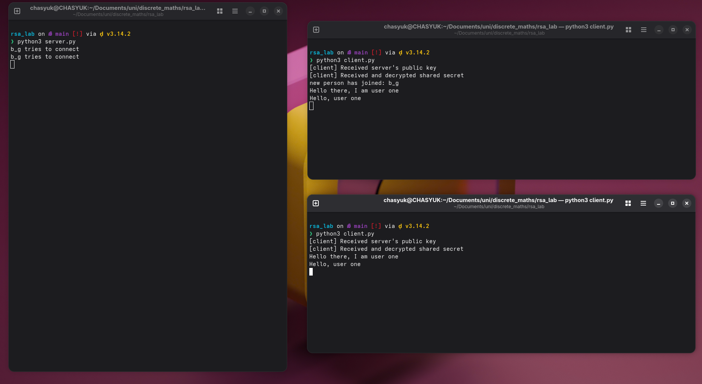

# Лабораторна робота 2 — RSA шифрування

## Інструкції до запуску

Для запуску потрібен Python 3.

1. Клонувати репозиторій та перейти в директорію проекту:

```bash
git clone <url-репозиторію>
cd rsa_lab
```

1. Запустити сервер в першому терміналі:

```bash
python3 server.py
```

1. Запустити клієнт в другому терміналі:

```bash
python3 client.py
```

1. Для підключення ще одного клієнта — відкрити третій термінал та запустити `python3 client.py` знову.

---

## Коротке пояснення імплементації

### Структура проекту

| Файл | Призначення |
|------|-------------|
| `main.py` | RSA функції (генерація ключів, шифрування/дешифрування) та симетричне XOR шифрування |
| `server.py` | TCP сервер з обміном ключами та шифрованою розсилкою повідомлень |
| `client.py` | TCP клієнт з обміном ключами та шифруванням повідомлень |

### Алгоритм роботи

```
Клієнт                              Сервер
  |                                    |
  |---- username -------------------->|
  |                                    |
  |---- public key (e, n) ----------->|  # Клієнт генерує RSA ключі
  |                                    |
  |<--- public key (e, n) ------------|  # Сервер відправляє свій публічний ключ
  |                                    |
  |<--- encrypted secret -------------|  # Сервер шифрує секрет публічним ключем клієнта
  |                                    |
  |  [дешифрує секрет приватним ключем]|
  |                                    |
  |==== зашифровані повідомлення =====>|  # XOR шифрування спільним секретом
  |<=== зашифровані повідомлення ======|
```

### RSA (main.py)

- **Генерація ключів** (`generate_keys`): використовує два великих простих числа p = 10^100 + 267, q = 10^100 + 949. Обчислює n = p·q, φ(n) = (p-1)·(q-1), e = 2^16 + 1, та d через розширений алгоритм Евкліда.
- **Шифрування** (`encode_message`): перетворює повідомлення в число, шифрує за формулою c = m^e mod n, додає SHA-256 хеш для перевірки цілісності.
- **Дешифрування** (`decode_message`): дешифрує за формулою m = c^d mod n, перевіряє хеш.
- **Симетричне шифрування** (`symmetric_encrypt` / `symmetric_decrypt`): XOR з ключем для шифрування повідомлень чату.

### Обмін ключами (server.py + client.py)

1. Клієнт підключається та відправляє ім'я користувача
2. Клієнт генерує RSA ключі та відправляє публічний ключ серверу
3. Сервер відправляє свій публічний ключ клієнту
4. Сервер шифрує спільний секрет (`"AndriiMuzynchyk123"`) публічним ключем клієнта та відправляє
5. Клієнт дешифрує секрет своїм приватним ключем
6. Всі подальші повідомлення шифруються XOR з цим спільним секретом

---

## Результати запуску


